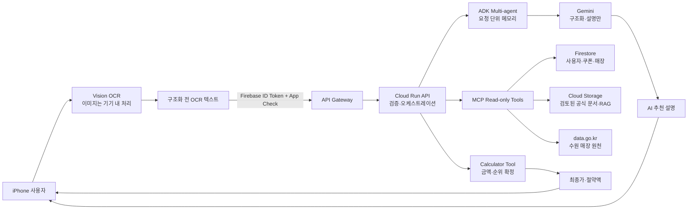

# 쿠폰콕 상용화 AI·보안·데이터 준수 설계

- 문서 버전: 2026-08-20.v1
- 책임자: 박재현
- 적용 범위: iOS 앱, Firebase, API Gateway, Cloud Run API, MCP 도구, ADK 오케스트레이터, Vertex AI/Gemini, Firestore, Cloud Storage, data.go.kr
- 성격: 제품·개발·운영 통제 설계 문서. 법률 자문이 아니며, 출시 직전 현행 법령·약관·개인정보처리방침·위치정보 규정을 별도로 확인한다.

## 1. 결론과 적용 수준

쿠폰콕은 Gemini를 이용해 OCR 텍스트를 구조화하고 추천 이유를 생성하므로, 제공된 인공지능기본법 기준으로 `인공지능이용사업자`에 해당할 가능성이 높다. 현재의 소비 할인 추천은 대출·신용평가·고용·의료·공공급여 등 법률이 열거한 중대한 의사결정을 수행하지 않으므로 고영향AI일 가능성은 낮다. 다만 기능 변경 전에 해당 여부를 다시 검토하고 기록한다.

세 종류의 자료는 다음처럼 구분해 적용한다.

| 구분 | 쿠폰콕 적용 | 제품 판단 |
|---|---|---|
| 인공지능기본법·시행령 | 국내 이용자 대상 생성형 AI 서비스에 직접 관련 | AI 사용 사전고지와 생성 결과 표시를 제품 요구사항으로 적용 |
| 국가·공공기관 AI 보안/클라우드/사이버보안 문서 | 민간 소비자 앱에 일반적으로 직접 강제되는 기준은 아님 | 상용화 보안 통제로 자발 적용. 공공기관 납품 시 계약·기관 기준으로 재분류 |
| 공공데이터 AI 친화적 관리 가이드라인 | 가이드 자체는 비구속적이며 원래 대상은 공공데이터 생산·관리자 | data.go.kr와 공식 혜택 RAG의 메타데이터·품질·버전·권리 관리 기준으로 자발 적용 |

`필수`라는 표현은 이 문서에서 쿠폰콕이 자체 승인한 출시 게이트를 의미한다. 공공 가이드의 체크리스트 등급을 법적 의무라고 표현하지 않는다.

## 2. 시스템 경계와 데이터 흐름



금액과 추천 순위의 단일 진실 원천은 Calculator다. Gemini와 ADK는 다음을 할 수 없다.

- 할인율·할인액·중복 가능 여부를 자유 생성
- 공식 규칙에 없는 혜택을 계산 후보로 추가
- Calculator가 산출한 최종가·절약액·순위를 변경
- 승인되지 않은 외부 도구나 쓰기 작업 실행

## 3. 데이터 분류와 처리 정책

| 데이터 | 분류 | 저장 위치 | 처리·보존 정책 |
|---|---|---|---|
| 쿠폰 원본 이미지 | 제한/사용자 콘텐츠 | iPhone 앱 저장소 | Vision OCR 후 서버로 전송하지 않음. 쿠폰·계정 삭제 시 함께 제거 |
| OCR 추출 텍스트 | 제한/개인정보 가능 | 전송 중, Gemini 구조화 입력 | 애플리케이션 DB에 원문을 영구 저장하지 않음. 전송 전 바코드·연락처·주문번호 최소화 필터를 추가해야 함 |
| 구조화 쿠폰 | 개인정보 | iPhone, Firestore 사용자 경로 | 사용자가 삭제할 때까지. 계정 전체 삭제 제공 |
| 통신사·멤버십 등급 | 개인정보/프로필 | Firestore 사용자 경로 | 선택 입력, 최소 수집. 계정 전체 삭제 제공 |
| 카드 상품 ID·실적 충족 여부·잔여 한도 | 개인정보/금융 관련 프로필 | Firestore 사용자 경로 | 카드번호·계좌번호·CVC·거래내역은 수집 금지 |
| 현재 위치 | 민감도가 높은 기기 정보 | iOS Core Location 메모리 | 매장 감지에만 사용하고 좌표 이력을 서버에 저장하지 않음 |
| 수원 매장 데이터 | 공개/운영 데이터 | Firestore 매장 컬렉션 | 원천 ID·좌표계·수집일·버전·품질 플래그를 함께 저장 |
| 통신사·카드 공식 혜택 | 공개 또는 권리 검토 대상 | 비공개 Cloud Storage | 공식성·권리·확인일·유효기간·버전·해시를 통과한 문서만 active |
| 프롬프트·도구 호출 로그 | 내부/개인정보 가능 | Cloud Logging·Trace | 원문·바코드·쿠폰번호·토큰·secret 기록 금지. 운영 베타 목표 90일 후 삭제 |

Cloud Logging 1년 보관은 제공된 공공기관 기준의 벤치마크다. 민간 쿠폰콕의 법정 보존기간이라고 주장하지 않는다. 공공기관 공급 계약이 생기면 별도 보존기간과 로그 필드를 적용한다.

## 4. 인공지능기본법 제품 요구사항

### 4.1 서비스 분류

| 항목 | 판단 | 근거·조치 |
|---|---|---|
| AI 시스템 사용 | 해당 | Gemini가 OCR 구조화·추천 설명을 생성 |
| 인공지능이용사업자 | 해당 가능성 높음 | 제3자 모델로 소비자 대상 AI 기능 제공 |
| 생성형 AI | 해당 | 자연어 구조화와 추천 설명 생성 |
| 고영향AI | 현재 비해당 가능성 높음 | 소비 할인 선택 보조이며 신용·대출·고용·의료·공공혜택 자격을 결정하지 않음 |
| 대규모 모델 안전성 의무 | 현재 비해당 가능성 높음 | 자체 기초모델 훈련이 없고 광범위·중대한 위험 시스템이 아님 |

고영향AI 사전검토 기록은 출시마다 다음을 남긴다.

1. 기능, 모델, 입력·출력, 사용자와 인간 개입 구조
2. 열거 영역별 해당·비해당 근거
3. 권리·의무에 미치는 영향과 오류 피해
4. 검토자, 날짜, 모델·정책 버전
5. 아래 변경 트리거 발생 여부

재검토 트리거는 신용·대출·보험·결제 승인, 개인별 차등가격, 공공혜택 자격, 의료·교육·채용 판단, 자동 구매·결제·환불, 실명 금융거래 연동이다.

### 4.2 이용자 고지와 생성 결과 표시

AI 기능을 실행하기 전에 다음 문구를 표시한다.

> 생성형 AI가 쿠폰 문구와 추천 이유를 설명합니다. 할인액·순위·중복 여부는 규칙 기반 Calculator가 산정합니다.

결과는 다음처럼 시각적으로 구분한다.

- OCR 검토 화면: `AI 추출 초안 · 사용자 확인 필요`
- 추천 설명: `생성형 AI가 작성한 추천 설명`
- 가격 카드: `규칙 기반 Calculator 결과`
- 공식 혜택: 문서명, 제공자, URL, 확인일, 버전
- 근거가 없거나 오래된 경우: `공식 근거 확인 필요`로 fail closed

고지 문구·화면·배포 버전·스크린샷을 릴리스 증적으로 보관한다.

## 5. Responsible AI와 Guardrail

### 5.1 위험과 통제

| 위험 | 예방 통제 | 탐지·대응 |
|---|---|---|
| AI가 잘못된 금액 생성 | Calculator 전용 금액 산정, ADK 결과 계약 검증 | 값 불일치 시 AI 결과 폐기·안전 템플릿 사용 |
| 쿠폰 OCR 오인식 | 기기 내 OCR, 구조화 결과 사용자 확인 | 낮은 신뢰 필드 강조, 저장 전 필수값 검증 |
| 비공식·오래된 혜택 | 제공자별 공식 도메인, checkedAt·staleAfter·version·rights gate | stale·retired 문서 검색 0건, 운영자 재검토 큐 |
| 프롬프트 인젝션 | 사용자 입력·RAG 문서·시스템 지시 신뢰영역 분리, Zod/Pydantic 스키마 | 도구 호출 allowlist 위반 차단, 세션 종료, 보안 이벤트 기록 |
| RAG 포이즈닝 | 별도 ingest 계정, immutable object, SHA-256, 검토자 | 손상된 chunk·rule 런타임 재검증, index generation 충돌 차단 |
| 사용자 간 메모리 혼선 | ADK `InMemorySessionService`를 요청마다 새로 생성 | 요청 종료와 함께 메모리 폐기, 사용자 ID 원문 로그 금지 |
| 비용 폭증·루프 | 요청 배열·문자열·timeout 제한, shadow 배포 | 요청·도구 횟수·비용 임계치 초과 시 자동 중단 |
| 개인정보 유출 | 이미지 기기 보관, 최소 필드, 로그 마스킹 | 계정·클라우드·기기 데이터 삭제, 사고 플레이북 실행 |

### 5.2 Multi-agent 권한 경계

- Matcher Agent: 매장·쿠폰 후보 식별, 읽기 전용
- Benefit Agent: RAG 근거 검색, 읽기 전용
- Calculator Agent/Tool: 검증된 숫자 규칙만 계산
- Explanation Agent: Calculator 결과와 공식 출처를 설명하는 텍스트만 생성
- Root Agent: 순서 제어와 계약 검증만 수행

사용자 데이터 수정·삭제, 외부 메시지, 결제, 쿠폰 발급·취소는 Agent 도구로 제공하지 않는다. 향후 제공할 경우 별도 사람 승인과 idempotency key가 필수다.

## 6. RAG·공공데이터 거버넌스

### 6.1 문서 생명주기

```text
draft → reviewed → active → expired/withdrawn/retired
```

`active` 승격 조건:

- 공식 제공자 HTTPS 도메인
- 확인일과 staleAfter
- 적용 시작·종료일
- 경로에 안전한 immutable version
- 검토자
- 이용권리 판단과 제한사항
- 원문 요약 content hash
- Calculator 규칙이 있으면 적용 매장, 할인 값, 최대한도, 최소금액, 중복 정책을 모두 명시

권리 상태가 `unknown`, `pending`, `미확인`, `검토중`이면 색인하지 않는다. 통신사·카드사 웹은 공공데이터가 아니므로 공공데이터 라이선스로 간주하지 않는다. 링크·사실 요약 범위와 상업적 이용·수집·재배포 가능 여부를 제공자별로 검토한다.

오류·종료·약관 변경 시 문서를 덮어쓰지 않고 tombstone을 남긴다. 검색·Calculator에서는 즉시 제외하고, 수정 문서는 새 버전으로 적재한다.

### 6.2 권장 Source Registry

| 그룹 | 필드 |
|---|---|
| 식별 | sourceId, sourceKind, title, publisher, officialityEvidence |
| 접근 | landingURL, accessURL, termsURL, contactRole |
| 권리 | licenseId, rightsDecision, attributionText, allowedFetch, allowedIndex, allowedCommercial, allowedRedistribute |
| 시공간 | spatialCoverage, temporalStart, temporalEnd, updateFrequency |
| 최신성 | upstreamIssuedAt, upstreamModifiedAt, retrievedAt, staleAfter, status |
| 버전 | upstreamVersion, localReleaseVersion, schemaVersion, versionNotes |
| 무결성 | rawObjectURI, rawSHA256, httpETag, httpLastModified, pipelineVersion |
| 품질 | qualityReportId, qualityFlags, limitations |

### 6.3 품질 게이트

| 품질 차원 | 출시 게이트 |
|---|---|
| 완전성 | 계산 규칙의 대상·금액·한도·기간·중복 조건 필수값 100% |
| 유효성 | 날짜 ISO 8601 실달력, 할인율 0~100, 시간 0~23, 금액 0 이상 |
| 정확성 | 골드셋 Calculator 결과 exact match 100% |
| 출처성 | 공식 URL·검토자·확인일·버전·해시 없는 문서 검색 0건 |
| 최신성 | staleAfter 초과 문서 검색·계산 0건 |
| 유일성 | 동일 documentId의 active 버전은 한 개, near duplicate 경고 |
| RAG | 혜택 금액을 사용한 답변의 citation coverage 100% |
| 회귀 | 모델·embedding·chunking 변경 시 고정 평가셋 통과 후 승격 |

## 7. GCP IAM 최소권한

장기 서비스 계정 키 파일은 만들지 않는다. Cloud Run의 연결된 서비스 계정과 단기 ID token을 사용한다.

| 주체 | 허용 권한 | 명시적 금지 |
|---|---|---|
| API Gateway SA | API Cloud Run Invoker | Firestore·Storage·Vertex·Secret 접근 |
| API Runtime SA | Firestore 사용자 문서 최소 접근, RAG object viewer, Vertex AI User, 필요한 secret 개별 accessor | RAG object 쓰기·삭제, IAM 변경, 전체 secret 조회 |
| Benefit Ingest Job SA | 전용 bucket object create/update, Vertex embedding, index generation 조건부 갱신 | 사용자 Firestore, data.go.kr key, API 관리자 |
| ADK Orchestrator SA | Vertex AI User, MCP Cloud Run Invoker | Firestore·Storage 직접 접근, 외부 인터넷 임의 호출 |
| MCP Runtime SA | RAG object viewer, 필요한 data.go.kr secret accessor | 사용자 데이터 쓰기, IAM 변경, benefit ingest |
| 배포 SA | 지정 Cloud Run/Artifact Registry 배포, 서비스 계정 사용 권한 | 프로젝트 Owner·Editor 상시 보유 |
| 개발자 | 그룹 기반 최소 역할, MFA | 공유 계정·공용 장기 키 |

API 런타임의 `BENEFIT_RUNTIME_SEED_PERSIST`는 `false`로 둔다. 문서 쓰기·철회는 Benefit Ingest Job만 수행한다.

## 8. 클라우드 공유책임

| 영역 | Google Cloud/Firebase | 쿠폰콕 운영자 |
|---|---|---|
| 물리 인프라·하이퍼바이저 | 책임 | 공급자 상태·계약 확인 |
| IAM·서비스 계정·API 공개 범위 | 기능 제공 | 설계·설정·정기 검토 책임 |
| 데이터 분류·최소수집·삭제 | 저장 기능 제공 | 수집 근거·보존·삭제 검증 책임 |
| 암호화 | 기본 전송·저장 암호화 제공 | 키·권한 분리와 민감정보 미저장 책임 |
| 취약점 | 관리형 서비스 패치 | 앱·의존성·컨테이너·MCP·Agent 테스트 책임 |
| 로그·탐지 | Logging/Trace 제공 | 마스킹·경보·검토·사고대응 책임 |
| 가용성·복구 | 서비스 SLA | 애플리케이션 fallback·백업·복구훈련 책임 |

## 9. 사고대응 플레이북

| 사고 | 즉시 조치 | 복구·증적 |
|---|---|---|
| 잘못된 혜택·가격 | 해당 RAG 문서 retire, AI 설명 비활성화, Calculator 안전경로 유지 | source version·hash·영향 요청·수정 테스트 보존 |
| 프롬프트 인젝션 | 해당 세션 종료, 도구 호출 차단, 공격 입력 hash 기록 | rule·prompt·eval 보강 후 shadow 재배포 |
| secret 노출 | secret 버전 폐기·회전, 서비스 계정 token 무효화 | 감사로그 확인, 저장소·이미지·로그 재검색 |
| 개인정보 유출 | 관련 처리 중단, 접근 차단, 영향 범위 확인 | 법정 통지 의무 별도 판단, 삭제·재발 방지 증적 |
| RAG 포이즈닝 | index alias/버전 롤백, 문서 tombstone | 공식 원문·hash 재검증, ingest 계정과 로그 조사 |
| Agent 무한루프·비용 폭증 | ADK mode off, 요청·도구 budget 차단 | trace 분석, 임계치·eval 보강 |

사고 중에는 원본 로그를 임의 삭제하거나 시스템을 포맷하지 않는다. 비밀값과 개인정보를 제외한 request ID, 버전, hash, 호출 순서, 차단 결과를 증거로 보존한다.

## 10. 구현 추적성

| 요구사항 | 구현 위치 | 검증 | 상태 |
|---|---|---|---|
| AI 사용 사전고지 | `Views/ContentView.swift` | 실기기/시뮬레이터 화면 확인 | 구현 |
| AI 설명과 Calculator 분리 | `Views/RecommendationSheet.swift`, `src/calculator.ts` | API 계약·UI 빌드 | 구현 |
| 공식 RAG 메타데이터 | `src/benefitRag.ts` | validator 단위 테스트 | 구현 |
| 비공식·stale·손상 rule 차단 | `src/benefitRag.ts` | 오류 입력 회귀 테스트 | 구현 |
| RAG immutable version·hash | `src/benefitRag.ts` | object path·응답 metadata 검사 | 구현 |
| RAG 철회 tombstone | `retireOfficialBenefit`, `scripts/retireBenefit.ts` | active→retired 검색 제외 테스트 | 구현, GCP 통합 테스트 필요 |
| API 런타임 RAG read-only | `BENEFIT_RUNTIME_SEED_PERSIST=false` | IAM deny/write 검증 | 코드 지원, IAM 설정 필요 |
| 요청 단위 Agent memory | `CouponPilotAgent/couponcok_agent/server.py` | 연속 사용자 요청 격리 테스트 | 구현 |
| 계정·Firestore·기기 삭제 | `App/CouponPilotApp.swift` | 새 익명 계정 생성·기존 데이터 부재 확인 | 구현, 실기기 검증 필요 |
| App Check | iOS provider, backend monitor/enforce | 실기기 App Attest와 공격 요청 401 | 코드 구현, enforce 전환 필요 |
| 중앙 Trace·AgentOps | `src/observability.ts` | Cloud Trace에서 request→tool span 확인 | API 계측 일부, exporter 미완성 |
| 위치·개인정보 정책 | UI·개인정보처리방침 | 스토어 심사 문서·삭제 테스트 | 정책 문서 작성 필요 |
| 고영향AI 사전평가 | 본 문서 | 릴리스 체크리스트 서명 | 최초 판단 완료, 기능 변경마다 재검토 |

## 11. 출시 게이트

### P0 — 외부 베타 전에 완료

- Firebase App Check를 monitor에서 enforce로 전환하고 실기기 App Attest 검증
- 역할별 서비스 계정 생성 및 프로젝트 기본 Compute SA 제거
- Benefit Ingest Job 전용 SA로 RAG v2 index 게시, API SA 쓰기 권한 부재 검증
- 개인정보처리방침·이용약관·AI 사용 안내 URL 공개
- 위치·알림 권한 온보딩과 설정 복구 경로 실기기 검증
- 계정 전체 삭제와 재가입 E2E 검증
- 가격 Calculator 골드셋, stale RAG, 비공식 출처, 프롬프트 인젝션 회귀 테스트
- Cloud Run·Firestore·Storage audit log와 비용 경보 설정

### P1 — 상용 출시 전에 완료

- OpenTelemetry SDK/exporter와 Trace 기반 SLO·경보
- 최소 30~50개 ADK trajectory/eval 골드셋과 shadow→canary 승격 기준
- SBOM/AIBOM, 의존성·컨테이너 취약점 검사
- Terraform 등 IaC로 IAM·Cloud Run·Gateway·Storage 정책 재현
- 원천 혜택 갱신 스케줄러와 stale 검토 큐
- 장애·삭제·RAG 롤백 복구훈련 및 기록
- 접근성 VoiceOver·Dynamic Type·대비 테스트

## 12. 근거 문서와 사용 범위

| 문서 | 사용한 범위 |
|---|---|
| 인공지능 발전과 신뢰 기반 조성 등에 관한 기본법 | AI 사업자 정의, 고영향 영역, 생성형 AI 고지·표시, 사전검토 |
| 같은 법 시행령 | 고지·표시 방법, 고영향 해당 여부 확인 절차, 안전성 범위 |
| 국가·공공기관 AI 보안 가이드북 | AI 공급망, 입력·출력 보호, Agent 도구 allowlist·최소권한·로깅·자동 중단 |
| 국가 클라우드 컴퓨팅 보안 가이드라인 | IAM, 암호화, 로그, 공급망, 데이터 삭제, 공유책임·SLA |
| 국가 사이버보안 기본지침 | 공공기관 적용 범위, AI 보안대책, 공공 클라우드·사고 대응 기준 |
| 공공데이터의 인공지능 친화적 관리 가이드라인 V1.0 | 비구속성 구분, 메타데이터, 품질, 버전·폐기, 개인정보·저작권·라이선스 |

제공된 자료의 주요 검토 위치는 AI 기본법 법률 PDF p.1~2, 12~15, 시행령 p.12~15, AI 보안 가이드북 PDF p.35~43 및 p.69~70, 국가 사이버보안 기본지침 PDF p.25, p.46~48, p.88~92, 공공데이터 가이드라인 PDF p.5, p.21~31, p.34~51, p.56~59다. 국가 클라우드 가이드라인은 IAM·로그·키·공급망·삭제·사고 대응 항목을 제품 통제로 재해석했다.
